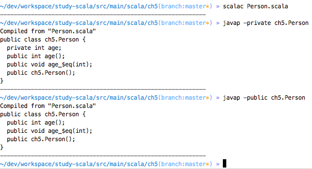

# Chapter5. 클래스

## 5.1 간단한 클래스와 인자 없는 메소드
<pre><code>
class Counter {
  private var value = 0
  def increment() = {
    value += 1
  }
  def current() = value
}

val myCoucnter = new Counter()
myCoucnter.increment() // accessor method 
myCoucnter.current // mutator method
</code></pre>

- 클래스는 public으로 선언되지 않음. (모든 클래스가 public 가시성임)
- 클래스를 사용하려면 일반적인 방법으로 오브젝트를 생성하고 메소드를 호출한다.
- 오브젝트 상태를 변경하지 않는 메소드는 ()를 생략. accessor method 
- 오브젝트의 상태를 바꾸는 경우 ()를 사용. mutator method

## 5.2 게터와 세터가 있는 프로퍼티
- 스칼라는 모든 필드에 대해 getter/setter method를 제공한다!!
    - 필드가 비공개이면 게터와 세터는 비공개이다
    - 필드가 val이면 게터만 생성된다
    - 게터나 세터가 필요없으면 필드를 private[this]로 선언한다
- 스칼라에서 게터와 세터 메소드는 age와 age_=로 불린다
- 
- 

## 5.3 게터만 있는 프로퍼티
- val 필드를 사용하면 된다
- 클라이언트는 마음대로 볼 수 없지만 어떤 다른 방법으로 수정되는 프로퍼티가 필요한 경우?
    - 필드는 private로 하고 별도의 함수를 제공하면 된다. ex) Counter의 increment()
    
    
## 5.4 오브젝트-비공개 필드

## 5.5 빈 프로퍼티
## 5.6 보조 생성자
## 5.7 기본 생성자
## 5.8 중첩 클래스
## 연습문제